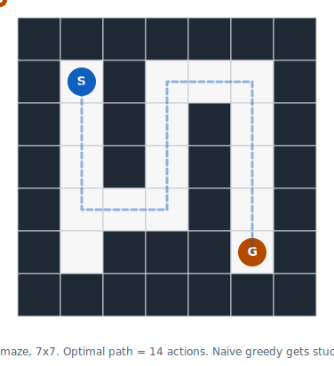
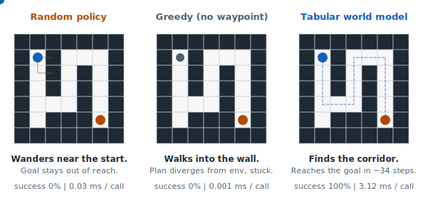
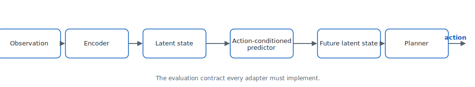

<section class="hero">
  <div class="hero-copy">
    <h1>Evaluating world models <span class="accent">like they will ship</span></h1>
    <p class="hero-pitch">
      Static AI benchmarks measure how well a model <em>predicts</em>. They miss what an applied team actually needs to know: success rate, latency budget, compute cost, robustness under perturbation. This is a small, opinionated evaluation layer that closes that gap.
    </p>
    <blockquote class="hero-quote">
      The next bottleneck for world models is not only model quality. It is proof of usefulness.
    </blockquote>
    <div class="hero-cta">
      <a class="btn-primary" href="06_demo.html">Read the walkthrough</a>
      <a class="btn-ghost" href="https://github.com/Denis-hamon/world-model-eval-lab">Code on GitHub</a>
    </div>
  </div>
  <figure class="hero-figure">
    
    <figcaption>An agent walks the 7x7 maze. Optimal path = 14 actions. The world-model planner finds it in ~33 steps with replanning.</figcaption>
  </figure>
</section>

<ul class="stat-strip">
  <li><span class="stat-value">5</span><span class="stat-label">tagged releases</span></li>
  <li><span class="stat-value">59</span><span class="stat-label">passing tests</span></li>
  <li><span class="stat-value">CPU-only</span><span class="stat-label">no GPU required</span></li>
  <li><span class="stat-value">25 s</span><span class="stat-label">to reproduce the headline sweep</span></li>
  <li><span class="stat-value">0</span><span class="stat-label">ML dependencies at runtime</span></li>
</ul>

[](https://github.com/Denis-hamon/world-model-eval-lab/actions/workflows/tests.yml)
[](https://www.python.org/downloads/)
[](https://github.com/Denis-hamon/world-model-eval-lab/blob/main/LICENSE)

## Three policies on the maze, side by side
{:.reveal}

Same environment, same 30 episodes, same seed - three different planners. Numbers below are pulled verbatim from `examples/maze_toy/sample_report.json`, regenerated every time `python -m examples.maze_toy.run_baseline` is run.
{:.reveal}

<section class="policy-comparison reveal">
  <article class="policy-card policy-fail">
    <header>
      <h3>Random</h3>
      <p class="policy-tagline">Samples actions uniformly at random.</p>
    </header>
    <div class="big-number">0%</div>
    <p class="big-label">success rate over 30 episodes</p>
    <dl class="card-stats">
      <div><dt>latency / call</dt><dd>0.03 ms</dd></div>
      <div><dt>compute / decision</dt><dd>n/a</dd></div>
      <div><dt>verdict</dt><dd>never reaches the goal.</dd></div>
    </dl>
  </article>

  <article class="policy-card policy-fail">
    <header>
      <h3>Greedy (no waypoint)</h3>
      <p class="policy-tagline">Always step toward the goal in Manhattan distance.</p>
    </header>
    <div class="big-number">0%</div>
    <p class="big-label">success rate over 30 episodes</p>
    <dl class="card-stats">
      <div><dt>latency / call</dt><dd>0.001 ms</dd></div>
      <div><dt>compute / decision</dt><dd>n/a</dd></div>
      <div><dt>verdict</dt><dd>bumps the wall, plan diverges from env, stuck.</dd></div>
    </dl>
  </article>

  <article class="policy-card policy-success">
    <header>
      <h3>Tabular world model</h3>
      <p class="policy-tagline">Random-shooting MPC over a learned-style dynamics function.</p>
    </header>
    <div class="big-number">100%</div>
    <p class="big-label">success rate over 30 episodes</p>
    <dl class="card-stats">
      <div><dt>latency / call</dt><dd>3.12 ms</dd></div>
      <div><dt>compute / decision</dt><dd>~256 rollout-units</dd></div>
      <div><dt>verdict</dt><dd>reaches the goal in ~34 steps (optimal is 14).</dd></div>
    </dl>
  </article>
</section>

<figure class="figure-wide reveal">
  
  <figcaption>The three agents, each animated in its own panel. Open in a new tab for a closer look.</figcaption>
</figure>

The captured terminal output of the run that produced those numbers:
{:.reveal}

```text
$ python -m examples.maze_toy.run_baseline
Scorecard: random  (perturbation: env-default)
  episodes                       : 30
  action success rate            : 0.000
  average steps to success       : n/a
  planning latency per call (ms) : 0.026
  perturbation recovery rate     : 0.000
  average compute per decision   : n/a

Scorecard: greedy-no-waypoint  (perturbation: env-default)
  episodes                       : 30
  action success rate            : 0.000
  average steps to success       : n/a
  planning latency per call (ms) : 0.002
  perturbation recovery rate     : 0.000
  average compute per decision   : n/a

Scorecard: tabular-world-model  (perturbation: env-default)
  episodes                       : 30
  action success rate            : 1.000
  average steps to success       : 33.800
  planning latency per call (ms) : 3.120
  perturbation recovery rate     : 1.000
  average compute per decision   : 256.410

Wrote sample report to examples/maze_toy/sample_report.json
```
{:.reveal}

## The evaluation contract any world model can plug into

{:.figure-architecture-img}

Every adapter exposes the four hooks above (`encode`, `rollout`, `score`, `plan`). The benchmark runner does the rest: rollouts, perturbations, latency measurement, scorecard. A concrete subclass under [`src/wmel/adapters/tabular_world_model.py`](https://github.com/Denis-hamon/world-model-eval-lab/blob/main/src/wmel/adapters/tabular_world_model.py) implements all four with stdlib-only random-shooting MPC.

## Effective planning horizon, made visible
{:.reveal}

The framework's first headline result: sweep the planning horizon of a tabular world-model planner on the maze toy and watch where it pays off. Hover any horizon below to see all of its metrics together. Success saturates at h = 15. Per-call latency keeps climbing past the plateau without buying any extra success - and steps-to-success start to degrade as the planner over-commits before replanning.
{:.reveal}

<div class="chart-container has-tooltips reveal" aria-label="Interactive horizon-sweep chart. Hover or focus a horizon to see its success rate, per-call latency, compute per decision, and average steps to success.">
  
</div>

The same scorecard structure applies to every benchmark card in [03_benchmark_cards.html](03_benchmark_cards.html). The applied questions change - "Can a world model push a part into spec faster than a hand-tuned controller on a 50 ms decision loop?" for Push-T, "Does a stacking model transfer to a new goal without retraining?" for OGBench Cube - but the columns stay the same.
{:.reveal}

## Reproduce in 25 seconds, on a laptop, no GPU
{:.reveal}

```bash
git clone https://github.com/Denis-hamon/world-model-eval-lab.git
cd world-model-eval-lab
pip install -e ".[dev]"
python -m examples.maze_toy.run_horizon_sweep
```
{:.reveal}

You should see a scorecard, a Markdown-paste-ready table with Wilson confidence intervals, and a JSON report saved next to the example. All deterministic with `seed=0`.
{:.reveal}

## Read more
{:.reveal}

- [Thesis](00_thesis.html) - why static benchmarks miss the point.
- [Evaluation gap](01_evaluation_gap.html) - what is missing between research and deployment.
- [Metric taxonomy](02_metric_taxonomy.html) - the metric set, with a worked horizon-sweep example.
- [Benchmark cards](03_benchmark_cards.html) - Push-T, Reacher, Two-Room, Maze, OGBench Cube.
- [Industrial use cases](04_industrial_use_cases.html) - robotics, industrial automation, datacenter ops, logistics, safety monitoring.
- [30-day study plan](05_30_day_prototype_plan.html) - week-by-week scope and status.
- [Reading a scorecard](06_demo.html) - row-by-row walkthrough of a real sweep result.
{:.reveal}

## Releases
{:.reveal}

- [v0.5.0](https://github.com/Denis-hamon/world-model-eval-lab/releases/tag/v0.5.0) - pluggable perturbation library.
- [v0.4.0](https://github.com/Denis-hamon/world-model-eval-lab/releases/tag/v0.4.0) - Markdown export and compute-per-decision.
- [v0.3.1](https://github.com/Denis-hamon/world-model-eval-lab/releases/tag/v0.3.1) - initial public release.
{:.reveal}

## Disclaimer
{:.reveal}

This is an independent study of evaluation methodology for action-conditioned world models. It is **not** an official artifact of AMI, Meta, the LeWorldModel project, or any of their authors, and **not** an artifact of any current or past employer of the author. References to JEPA-style or LeWorldModel concepts are conceptual, not affiliational.
{:.reveal}
