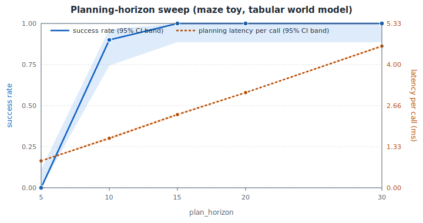

# World Model Evaluation Lab

A decision-oriented benchmark framework for evaluating action-conditioned world models beyond static AI benchmarks.

[](https://github.com/Denis-hamon/world-model-eval-lab/actions/workflows/tests.yml)
[](https://www.python.org/downloads/)
[](https://github.com/Denis-hamon/world-model-eval-lab/blob/main/LICENSE)
[](https://github.com/Denis-hamon/world-model-eval-lab)

## Thesis

> The next bottleneck for world models is not only model quality. It is proof of usefulness.

Static AI benchmarks (reconstruction loss, FID, next-frame prediction) measure how well a model **predicts**. They do not measure whether it is **useful** in a closed loop, under a latency budget, under a compute budget, under perturbation.

This repository is an independent study of evaluation methodology for action-conditioned world models. It proposes a small, opinionated evaluation layer that any model can plug into.

## The contract any world model can implement


Each adapter exposes the four hooks above. The benchmark runner does the rest: rollouts, perturbations, latency measurement, scorecard.

## What the scorecard reveals

Sweep the planning horizon of a tabular world-model planner on a small maze. Success rate saturates at h = 15. Per-call planning latency keeps rising past the plateau without improving outcomes - the **effective planning horizon** is visible in one chart.



Reproduce in 25 seconds on CPU:

```bash
git clone https://github.com/Denis-hamon/world-model-eval-lab.git
cd world-model-eval-lab
pip install -e ".[dev]"
python -m examples.maze_toy.run_horizon_sweep
```

## The toy environment

A 7x7 grid with two rooms separated by walls and a single corridor of free cells. Naive Manhattan-greedy gets stuck on walls. A random-shooting MPC over a tabular dynamics model reaches the goal in ~33 steps with ~256 rollout-units per decision.


## Read more

- [00 - Thesis](00_thesis.html) - why static benchmarks miss the point.
- [01 - Evaluation gap](01_evaluation_gap.html) - what is missing between research and deployment.
- [02 - Metric taxonomy](02_metric_taxonomy.html) - the metric set, with a worked horizon-sweep example.
- [03 - Benchmark cards](03_benchmark_cards.html) - Push-T, Reacher, Two-Room, Maze, OGBench Cube.
- [04 - Industrial use cases](04_industrial_use_cases.html) - robotics, industrial automation, datacenter ops, logistics, safety monitoring.
- [05 - 30-day study plan](05_30_day_prototype_plan.html) - week-by-week scope and status.
- [06 - Reading a scorecard](06_demo.html) - row-by-row walkthrough of a real sweep result.

## Releases

- [v0.5.0](https://github.com/Denis-hamon/world-model-eval-lab/releases/tag/v0.5.0) - pluggable perturbation library.
- [v0.4.0](https://github.com/Denis-hamon/world-model-eval-lab/releases/tag/v0.4.0) - Markdown export and compute-per-decision.
- [v0.3.1](https://github.com/Denis-hamon/world-model-eval-lab/releases/tag/v0.3.1) - initial public release.

## Disclaimer

This is an independent study of evaluation methodology for action-conditioned world models. It is **not** an official artifact of AMI, Meta, the LeWorldModel project, or any of their authors, and **not** an artifact of any current or past employer of the author. References to JEPA-style or LeWorldModel concepts are conceptual, not affiliational.

## License

MIT - see [LICENSE](https://github.com/Denis-hamon/world-model-eval-lab/blob/main/LICENSE).
