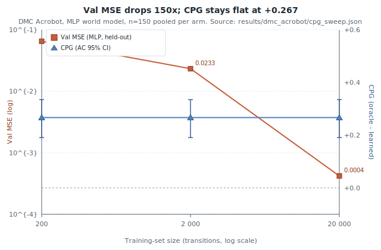
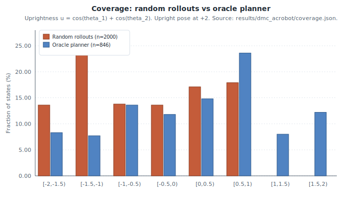
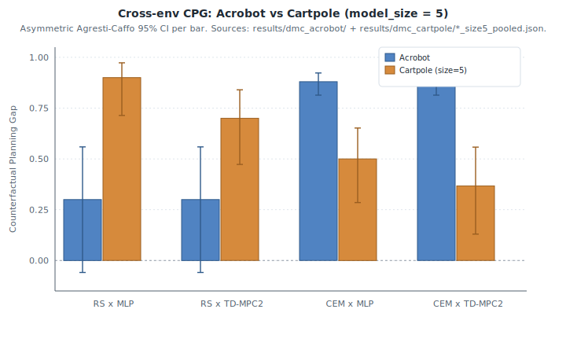
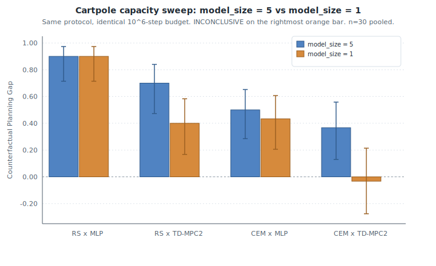
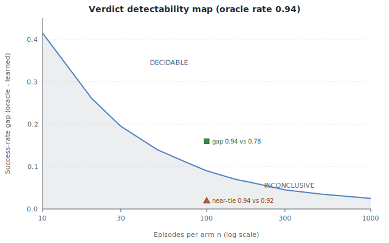

  
Short paper &middot; v0.17.0

  <h1 class="paper-title">Counterfactual Planning Gap</h1>
  
A Decision-Grade Metric for Decoupling Model Error from Planner Capacity in World Model Evaluation

  
Denis Hamon &nbsp;&middot;&nbsp; Independent &nbsp;&middot;&nbsp; <a href="mailto:denis.hamon1@gmail.com">denis.hamon1@gmail.com</a>

  

    <a class="btn-primary" href="https://github.com/Denis-hamon/world-model-eval-lab/raw/main/paper/main.pdf" download>Download PDF</a>
    <a class="btn-ghost" href="https://github.com/Denis-hamon/world-model-eval-lab/blob/main/paper/main.tex">LaTeX source</a>
    <a class="btn-ghost" href="https://github.com/Denis-hamon/world-model-eval-lab/blob/main/paper/references.bib">BibTeX</a>
  

  
PDF is rebuilt by CI on every push that touches <code>paper/**</code> and committed back to <code>paper/main.pdf</code>. If the link 404s on the first visit after a tag, the CI build is in progress; refresh in a couple of minutes.

## Abstract

Action-conditioned world models are routinely evaluated by prediction quality (reconstruction loss, frame-level FID, held-out one-step accuracy). Such metrics describe how well a model fits its training distribution. They are silent on the question that an applied team must answer before integrating a model into a control loop: *does the model, when used by a planner, produce decisions that succeed at the cost the deployment will accept?* We propose the **Counterfactual Planning Gap (CPG)**: the success-rate difference between a fixed planner using oracle dynamics and the same planner using the learned model on the same benchmark. The point estimate is the raw difference of success rates; the $95\%$ interval uses the Agresti--Caffo plus-4 adjustment, which keeps the variance positive at the boundary proportions $p \in \{0, 1\}$ where the standard Wald approximation collapses. We further define a five-branch verdict (`MODEL BOTTLENECK`, `LEARNED OUTPERFORMS ORACLE`, `PLANNER BOTTLENECK`, `MODEL AS GOOD AS ORACLE`, `INCONCLUSIVE`) gated on the lower bound of the CI rather than the raw point estimate, so under-powered runs cannot over-claim a diagnosis. The headline property is a decision rule that **changes its verdict on the strength of the evidence** — it returns `INCONCLUSIVE` both at small $n$ and at moderate $n$ on the one cell where a smaller-capacity learned model matches the oracle, and commits to `MODEL BOTTLENECK` only once the interval clears zero — behaviour a point-estimate leaderboard cannot reproduce. We package CPG as a ~160-line addition to a reusable framework (`wmel`) and report a worked example on DeepMind Control Suite Acrobot-swingup. On $10$ episodes per arm with a random-shooting MPC we observe raw $\mathrm{CPG} = +0.300$, AC $95\%$ CI $[-0.06, +0.56]$, verdict `INCONCLUSIVE`. A multi-seed extension to $n = 150$ pooled per arm hardens the result to $\mathrm{CPG} = +0.267$, CI $[+0.191, +0.335]$, `MODEL BOTTLENECK`. As a supporting ablation that prediction and decision quality dissociate, sweeping the MLP's training-set size by a factor of $100$ ($200 \rightarrow 20{,}000$ transitions) drops held-out validation MSE by $\sim\!150\times$ but leaves the verdict and CI *unchanged*: prediction quality improves dramatically, planning success stays at zero, the gap stays open. A robustness sweep replaces the bespoke MLP with TD-MPC2 (trained for $2 \times 10^{6}$ env steps) and the random-shooting planner with a Cross-Entropy Method planner of comparable compute: both learned arms remain at $0/10$, the oracle's success rate triples under CEM ($0.30 \to 0.90$), the gap opens to $\mathrm{CPG} = +0.900$, and pooling three seeds tightens it to $+0.880$, CI $[+0.814, +0.923]$ with both learned arms still at $0/150$. A second axis sweeps an in-episode action-burst perturbation (`DropNextActions(k)` at $k \in \{0, 1, 5\}$) and the `MODEL BOTTLENECK` verdict survives every cell. A cross-environment replay on DMC Cartpole-swingup (three seeds pooled to $n = 30$ per arm) reproduces `MODEL BOTTLENECK` in every cell at TD-MPC2 `model_size = 5` and in three of four cells at `model_size = 1`; the fourth (CEM × TD-MPC2 at `model_size = 1`) returns `INCONCLUSIVE` at $n = 30$ because the learned arm reaches $0.533$ vs an oracle at $0.500$ and the AC CI crosses zero ($[-0.28, +0.21]$) — the five-branch gate fires its `INCONCLUSIVE` branch at moderate $n$ for the first time. A third environment, DMC Reacher-easy (a $2$-DOF reaching arm with a two-dimensional action), gives the cleanest case: the oracle solves the reach perfectly ($1.000$) and both learned arms are clearly non-zero ($0.300$–$0.633$), so all four cells are `MODEL BOTTLENECK` on *genuine, non-degenerate* gaps ($+0.367$ to $+0.700$) and the verdict ranks the two learned dynamics by how much planning success they forfeit. The metric does its job: it separates a dynamics-quality bottleneck on the learned arms from a planner-capacity contributor on the oracle arm, tracks gap magnitude rather than only gap presence, and travels across three environments at fixed family. Finally, because the verdict gate is a function of the confidence interval, it doubles as a power-analysis tool: we give the per-arm episode count a comparison needs before its interval clears zero, and show that a plausible leaderboard near-tie ($0.94$ vs $0.92$ at $n = 100$) is statistically indistinguishable from noise.

## 1. Introduction

The world-model literature has converged on three properties that motivate its existence: *prediction* of future observations conditioned on actions, *planning* by rolling those predictions out, and *transfer* across tasks that share latent structure [Ha & Schmidhuber, 2018; Hafner et al., 2023; Bardes et al., 2024; Bruce et al., 2024]. Most published evaluations focus on the first: reconstruction loss, frame-level FID, or next-frame prediction loss on held-out trajectories. These metrics are easy to compute and easy to compare across releases, but they are silent on a question any applied team must answer before integrating a learned world model into a control loop: *does using the model to plan produce decisions that succeed at the latency and compute the deployment will tolerate?*

The gap between prediction quality and decision quality is well documented. Hafner et al. (2019) report success rates on DeepMind Control Suite tasks alongside reconstruction loss because the two metrics disagree. Yu et al. (2020) and Kidambi et al. (2020) explicitly study *model exploitation* — the gap between a planner using a learned model and the same planner using the true environment dynamics — in offline model-based RL. Agarwal et al. (2021) document how rapidly point estimates of return mislead at small sample sizes, and prescribe interval reporting. What is missing is a packaged, reusable, decision-grade scalar that quantifies the gap with an honest confidence interval and a decision rule.

This paper makes three modest contributions:

1. We define the **Counterfactual Planning Gap (CPG)** as the success-rate difference between a planner using oracle dynamics and the same planner using a learned model, computed on identical benchmark runs that differ only in their `dynamics` callable (§3). The point estimate is the raw observed difference; the $95\%$ interval uses Agresti--Caffo plus-4. The verdict is gated on the AC lower bound.
2. We package CPG behind a minimal *evaluation contract* — a four-method adapter interface (`encode`, `rollout`, `score`, `plan`) that decouples the model from the runner and the metric (§2). Computing CPG is two calls to the same `BenchmarkRunner` plus one call to a metric function.
3. We show, across three DeepMind Control Suite tasks (Acrobot-swingup, Cartpole-swingup, Reacher-easy), that the decision rule *changes its verdict on the strength of the evidence*: it returns `INCONCLUSIVE` at $n = 10$ (raw gap $+0.30$, AC CI crossing zero) and again, at moderate $n$, on the one studied cell where a smaller-capacity learned model matches the oracle ($0.533$ vs $0.500$, CI $[-0.28, +0.21]$); it commits to `MODEL BOTTLENECK` only once the interval clears zero (§4.1–§4.10). A gate that flips on evidence strength is the property a point-estimate leaderboard cannot reproduce. A supporting ablation dissociates prediction from decision quality: held-out MSE drops $\sim\!150\times$ across a training-set-size sweep while the verdict and CI do not move.

The framework is open source ([github.com/Denis-hamon/world-model-eval-lab](https://github.com/Denis-hamon/world-model-eval-lab)), runs CPU-only without a GPU, and has no heavy ML dependency at runtime; PyTorch and `dm-control` are pulled in only for the worked-example adapters. CI verifies the contract on Python 3.11/3.12/3.13.

## 2. The Evaluation Contract and a Decision-Grade Taxonomy {#sec-framework}

### 2.1 The four-method contract

Every adapter in the framework implements

$$
\begin{aligned}
\texttt{encode} \;&:\; \mathcal{O} \to \mathcal{Z}, \\
\texttt{rollout} \;&:\; \mathcal{Z} \times \mathcal{A}^H \to \mathcal{Z}^{H+1}, \\
\texttt{score} \;&:\; \mathcal{Z} \times \mathcal{Z} \to \mathbb{R}, \\
\texttt{plan} \;&:\; \mathcal{O} \times \mathcal{O} \times \mathbb{N} \to \mathcal{A}^H.
\end{aligned}
$$

Here $\mathcal{O}$ is the observation space, $\mathcal{Z}$ the latent space (which may coincide with $\mathcal{O}$ for fully observed envs), $\mathcal{A}$ the action space, and $H$ the planning horizon. The runner queries `plan` on every replanning step and executes one or more of the returned actions in the real environment; the planner is free to use `encode`, `rollout`, and `score` internally however it sees fit. The contract makes no statement about how the model is trained.

For the present paper we use a random-shooting MPC: at each `plan` call, sample $N_\mathrm{cand}$ action sequences of length $H_\mathrm{plan}$ uniformly from $\mathcal{A}^{H_\mathrm{plan}}$, roll each one out through the dynamics, score the resulting trajectories, and return the best-scoring sequence prefix.

### 2.2 Decision-grade metrics

A metric is *decision-grade* iff (i) its units translate directly to a deployment-time cost or capability and (ii) it is computable only from closed-loop runs of the model, not from the model in isolation. Reconstruction loss and FID fail (ii); model-internal alignment scores fail (i). The metrics that survive both criteria are: action success rate, average steps to success, per-call planning latency, compute per decision, perturbation recovery rate, the effective planning horizon, and — the contribution of this paper — the Counterfactual Planning Gap.

## 3. Counterfactual Planning Gap {#sec-cpg}

### 3.1 Definition

Fix an environment $\mathcal{E}$, a planner $\pi$, a scoring function $\sigma$, a number of episodes $N$, a horizon $T$ and a seed. Let $\mathrm{success\_rate}(D)$ denote the empirical success rate of $\pi$ on $N$ episodes of $\mathcal{E}$ when the planner queries dynamics $D$ during its internal rollouts. Let $D^{\star}$ be the *oracle* dynamics (the true env's transition function) and $D_\theta$ be a learned model. The Counterfactual Planning Gap is

$$
\mathrm{CPG} \;=\; \mathrm{success\_rate}(D^{\star}) \;-\; \mathrm{success\_rate}(D_\theta).
$$

All free quantities on the right-hand side — env, planner, score, $N$, $T$, seed — are held fixed between the two runs. The only thing that changes is the `dynamics` callable. This identification is what licenses interpreting CPG as a property of the *model* rather than the planner or the env.

### 3.2 Statistical reporting

Let $s_o, s_\ell$ be the success counts in the oracle and learned arms and $n_o, n_\ell$ the corresponding episode counts. The raw point estimate of CPG is the difference of proportions:

$$
\hat{\Delta} \;=\; \frac{s_o}{n_o} - \frac{s_\ell}{n_\ell}.
$$

The standard Wald $95\%$ CI on $\hat\Delta$ has variance $p_o(1-p_o)/n_o + p_\ell(1-p_\ell)/n_\ell$, which collapses to zero whenever *either* arm sits at $p \in \{0, 1\}$. With $n_\ell = 10$ episodes and a learned planner that fails on every episode, this is precisely the regime the framework lands in. A degenerate-variance CI in this regime falsely produces a tight interval and over-claims significance.

We instead use the Agresti--Caffo plus-4 adjustment [Agresti & Caffo, 2000], adding one pseudo-success and one pseudo-failure to each arm:

$$
\begin{aligned}
\tilde p_o &= \frac{s_o + 1}{n_o + 2}, \quad \tilde p_\ell = \frac{s_\ell + 1}{n_\ell + 2}, \\
\tilde \Delta &= \tilde p_o - \tilde p_\ell, \\
\mathrm{SE} &= \sqrt{\frac{\tilde p_o (1 - \tilde p_o)}{n_o + 2} + \frac{\tilde p_\ell (1 - \tilde p_\ell)}{n_\ell + 2}}, \\
\mathrm{CI}_{95\%}(\mathrm{CPG}) &= \bigl[\, \tilde\Delta - 1.96\,\mathrm{SE}, \;\; \tilde\Delta + 1.96\,\mathrm{SE} \,\bigr].
\end{aligned}
$$

The framework reports both the raw $\hat\Delta$ (what a reader expects to see) and the AC interval (what is statistically defensible). The two coincide for large $n$.

### 3.3 Gated verdict

A point estimate without a significance gate over-claims. The framework therefore exposes a five-branch decision rule that consults the AC interval, **not** the raw $\hat\Delta$:

  
MODEL BOTTLENECK &mdash; $\mathrm{CI}_{\mathrm{lo}} &gt; 0$. The oracle is reliably better; closing the gap is a model problem.

  
LEARNED OUTPERFORMS &mdash; $\mathrm{CI}_{\mathrm{hi}} &lt; 0$. Rare; investigate regularisation or planner-search interactions.

  
PLANNER BOTTLENECK &mdash; CI crosses $0$ <em>and</em> both success rates are within $\tau$ of $0$. Neither planner solves the task.

  
MODEL AS GOOD AS ORACLE &mdash; CI crosses $0$ <em>and</em> both success rates are within $\tau$ of $1$.

  
INCONCLUSIVE &mdash; CI crosses $0$ in a middle-of-the-road regime. Run more episodes.

Default tolerance $\tau = 0.05$. Crucially, `MODEL BOTTLENECK` is *not* the default when $\hat\Delta > 0$; it requires the AC lower bound to be strictly positive.

### 3.4 Properties

CPG is bounded in $[-1, 1]$, antisymmetric in the role of the two dynamics, and additive: on a benchmark suite split into disjoint sub-tasks, CPG on the union is the episode-weighted mean of the per-sub-task CPGs. The metric is silent about *why* the model degrades planning (latent shift, prediction-error accumulation, score-function mismatch); follow-up diagnostics are needed to attribute. It is, however, sufficient to distinguish model-side failures from planner-side failures at the verdict granularity.

## 4. Empirical Study: DMC Acrobot-Swingup {#sec-empirical}

### 4.1 Setup

We use DMC Acrobot-swingup [Tassa et al., 2018; Tunyasuvunakool et al., 2020]: a two-link underactuated pendulum with a continuous torque action in $[-1, +1]$ that must build energy and balance the tip upright. We discretise the action to a five-level torque set $\{-1, -0.5, 0, +0.5, +1\}$ to fit the framework's hashable-action contract. The observation is a six-dimensional vector $(\sin\theta_1, \sin\theta_2, \cos\theta_1, \cos\theta_2, \dot\theta_1, \dot\theta_2)$ in the layout returned by `dm_control.suite.acrobot.Physics.orientations`. Success at step $t$ is $r_t \geq 0.6$ where $r_t$ is the DMC dense reward.

The scoring function is $\sigma(\mathbf{o}, \cdot) = -(\cos\theta_1 + \cos\theta_2)$, a unit-length approximation of the negative tip height. The planner is random-shooting MPC with $N_\mathrm{cand} = 50$ candidate sequences of length $H_\mathrm{plan} = 15$, executed at every replanning step. Episodes run for at most $T = 500$ env steps. Seed $0$ throughout.

### 4.2 Oracle dynamics

We construct the oracle by instantiating a private `dm_control` environment inside a $(\mathrm{state}, \mathrm{action}) \to \mathrm{state}$ callable. Each call reconstructs $(q_\mathrm{pos}, q_\mathrm{vel})$ from the flat observation via $\mathrm{atan2}$, writes them into the private env's MuJoCo physics, calls `physics.forward`, steps once with the candidate torque, and returns the new flat observation. We verify the oracle reproduces `env.step` to numerical precision ($|\Delta| < 10^{-5}$) over a fifty-step random-policy rollout; this regression test is part of CI.

### 4.3 Learned dynamics

We train a Markovian MLP (two hidden layers of width $64$, ReLU activations) on $2\,000$ random-policy transitions collected from ten episodes of $200$ steps each. The input concatenates the six-dimensional observation with a five-dimensional one-hot action; the output predicts the next observation. Training: $200$ epochs with Adam (lr $10^{-3}$), batch size $256$, $10\%$ held-out validation split at the transition level. Final validation MSE $0.026$.

### 4.4 Results at $n = 10$

The oracle planner reaches the upright pose in $30\%$ of the episodes; the learned planner in $0\%$. The raw CPG is $+0.30$; the Agresti--Caffo $95\%$ interval is $[-0.06, +0.56]$, which crosses zero. The verdict is `INCONCLUSIVE`.

<table class="paper-table">
  <thead>
    <tr><th></th><th>Oracle dynamics</th><th>Learned MLP dynamics</th></tr>
  </thead>
  <tbody>
    <tr><td>Success rate</td><td>0.30 (3/10)</td><td>0.00 (0/10)</td></tr>
    <tr><td>Avg. steps to success</td><td>180.7</td><td>n/a</td></tr>
    <tr><td>Per-call planning latency (ms)</td><td>77.3</td><td>65.3</td></tr>
    <tr><td>Compute per decision (rollout-units)</td><td>407.1</td><td>157.3</td></tr>
  </tbody>
</table>

<table class="paper-table paper-table-narrow">
  <thead>
    <tr><th colspan="2">Counterfactual Planning Gap</th></tr>
  </thead>
  <tbody>
    <tr><td>Raw $\hat\Delta$</td><td>+0.300</td></tr>
    <tr><td>Agresti--Caffo 95% CI</td><td>[-0.059, +0.559]</td></tr>
    <tr><td>Verdict</td><td>INCONCLUSIVE</td></tr>
  </tbody>
</table>

Three readings are consistent with the data, and the framework declines to choose between them at $n = 10$: *model bottleneck*, *sample-size artifact*, *score-function mismatch*. A multi-seed extension that pushes $N$ to $\sim 100$ episodes per arm would tighten the AC half-width by roughly $\sqrt{10}$. **The metric's job at $n = 10$ is to refuse to choose; it does, correctly.** The next subsection resolves between the three readings by delivering that extension.

### 4.5 Multi-seed extension across training-set sizes {#sec-sweep}

We extend along two axes. *Episodes per arm* grows from $10$ to $50$ per seed (pooled across three seeds, $n = 150$ per arm), pushing the AC half-width below $0.10$. *Training-set size* sweeps the MLP's data budget across nearly three orders of magnitude: $\{200, 2\,000, 20\,000\}$ random-policy transitions. Every other quantity is held fixed.

The result is striking. The MLP's held-out validation MSE drops by a factor of $\sim\!150$; the learned planner's success rate stays at *exactly zero* in all $450$ benchmark episodes; the oracle planner's success rate is identical across cells; CPG returns the same point estimate, the same AC CI, and the same verdict `MODEL BOTTLENECK` in every cell.

<table class="paper-table">
  <thead>
    <tr><th>Train size</th><th>Val MSE</th><th>Oracle success</th><th>Learned success</th><th>CPG verdict</th></tr>
  </thead>
  <tbody>
    <tr><td>200</td><td>0.0651</td><td>40/150 = 0.267</td><td>0/150 = 0.000</td><td>+0.267, CI [+0.19, +0.33], MODEL BOTTLENECK</td></tr>
    <tr><td>2 000</td><td>0.0233</td><td>40/150 = 0.267</td><td>0/150 = 0.000</td><td>+0.267, CI [+0.19, +0.33], MODEL BOTTLENECK</td></tr>
    <tr><td>20 000</td><td>0.0004</td><td>40/150 = 0.267</td><td>0/150 = 0.000</td><td>+0.267, CI [+0.19, +0.33], MODEL BOTTLENECK</td></tr>
  </tbody>
</table>

The $n = 10$ reading admitted three explanations. The multi-seed result rules out the sample-size artifact (the CI no longer crosses zero) and is consistent with the score-function-mismatch hypothesis only as a contributor, not as the primary driver. The dominant story is *model bottleneck* — with a precise attribution that prediction quality alone obscures.

<figure>
  
  <figcaption><strong>Figure 1.</strong> Validation MSE (red, log scale, left axis) drops by $\sim\!150\times$ across the training-set sweep while CPG (blue, right axis) stays exactly flat at $+0.267$ with the same AC 95% CI $[+0.191, +0.335]$ in every cell. Predicting better did not plan better.</figcaption>
</figure>

### 4.6 What CPG separates: capacity vs. coverage

A naive reading is that the MLP simply needs more capacity. The validation MSE refutes this directly: at $20\,000$ transitions the model fits the training distribution to within $4\times 10^{-4}$, indistinguishable from numerical noise. The model has *ample* capacity for what it has been asked to predict.

What it has *not* been asked to predict is the upright-balancing regime. Random-policy rollouts in Acrobot rarely reach high-energy configurations; the upright pose is essentially absent from the training distribution. The model is therefore extrapolating during planning, and its predictions, accurate on the training manifold, are unreliable off it. The planner is misled, and success collapses.

This is most parsimoniously read as a *coverage* bottleneck rather than a *capacity* bottleneck. CPG cannot tell the two apart on its own, but in conjunction with held-out validation it can: a flat CPG curve across data-size sweeps, paired with a monotonically decreasing prediction loss, points to a data-distribution problem rather than to model size or architecture. Two second-order contributors are not ruled out by this experiment: a planner that is too weak to exploit a perfect model in the high-energy regime (the oracle planner reaches upright in only $27\%$ of episodes, so a stronger search procedure — CEM, gradient-based MPC — might lift both arms), and a score function $\sigma$ that approximates rather than matches the DMC reward. We treat coverage as the dominant explanation given the $\sim\!150\times$ drop in validation loss with no movement in success.

**Empirical receipt for the coverage claim.** We measure the visited-state distribution directly. On the natural "uprightness" axis $u(\mathbf{o}) = \cos\theta_1 + \cos\theta_2 \in [-2, +2]$ (upright pose at $+2$):

<table class="paper-table">
  <thead>
    <tr><th>Dataset</th><th>$n$ states</th><th>Mean $u$</th><th>Max $u$</th><th>Frac $u > 1.0$</th><th>Frac $u > 1.5$</th></tr>
  </thead>
  <tbody>
    <tr><td>Random rollouts</td><td>2 000</td><td>$-0.503$</td><td>$+0.865$</td><td><strong>0.00%</strong></td><td><strong>0.00%</strong></td></tr>
    <tr><td>Oracle planner</td><td>846</td><td>$+0.161$</td><td>$+1.866$</td><td>20.2%</td><td>12.2%</td></tr>
  </tbody>
</table>

The upright regime that swing-up requires is **strictly absent** from the training distribution: $0/2000$ random-rollout states have $u > 1.0$. The oracle planner visits that regime in roughly one-fifth of its trajectory. The MLP has never been shown a state from which the planner needs to predict. Numbers from [`results/dmc_acrobot/coverage.json`](https://github.com/Denis-hamon/world-model-eval-lab/blob/main/results/dmc_acrobot/coverage.json); the script is [`experiments/dmc_acrobot/coverage_analysis.py`](https://github.com/Denis-hamon/world-model-eval-lab/blob/main/experiments/dmc_acrobot/coverage_analysis.py).

<figure>
  
  <figcaption><strong>Figure 2.</strong> Empirical receipt for the coverage claim. The upright regime ($u > 1$) is strictly absent from the random-policy training data ($0/2000$ states); the oracle planner spends $20.2\%$ of its trajectory there.</figcaption>
</figure>

A second-axis sweep that varies the exploration policy under fixed data size would directly confirm coverage as the dominant driver. The natural remediation we recommend is to change the data-collection policy (energy-aware exploration, or relabelled trajectories that visit the swing-up regime), not to enlarge the network.

### 4.7 Robustness: a published world model and a stronger planner {#sec-robustness}

We add two robustness axes to the §4.4 setup. First, the bespoke MLP is replaced by **TD-MPC2** [Hansen et al., 2024] trained for $2 \times 10^{6}$ env steps; its encoder + latent dynamics are wrapped as a `dynamics=` callable for the same `TabularWorldModelPlanner`. Second, the random-shooting MPC is replaced by **CEM** of comparable compute (a fixed candidate budget, two iterations, top-fraction elite selection).

<table class="paper-table">
  <thead>
    <tr><th>Planner</th><th>Dynamics</th><th>Oracle</th><th>Learned</th><th>Raw CPG</th><th>AC 95% CI</th><th>Verdict</th></tr>
  </thead>
  <tbody>
    <tr><td>Random-shooting</td><td>MLP (v0.11 random-rollout data)</td><td>0.30</td><td>0.00</td><td>+0.300</td><td>[-0.059, +0.559]</td><td>INCONCLUSIVE</td></tr>
    <tr><td>Random-shooting</td><td>TD-MPC2 (2M)</td><td>0.30</td><td>0.00</td><td>+0.300</td><td>[-0.059, +0.559]</td><td>INCONCLUSIVE</td></tr>
    <tr><td>CEM</td><td>MLP (on TD-MPC2 data)</td><td>0.90</td><td>0.00</td><td>+0.900</td><td>[+0.487, +1.013]</td><td>MODEL BOTTLENECK</td></tr>
    <tr><td>CEM</td><td>TD-MPC2 (2M)</td><td>0.90</td><td>0.00</td><td>+0.900</td><td>[+0.487, +1.013]</td><td>MODEL BOTTLENECK</td></tr>
  </tbody>
</table>

Under random-shooting MPC the published TD-MPC2 dynamics fails as completely as the homemade MLP at $n = 10$. The CEM planner triples the oracle's success rate (`0.30` to `0.90`), but **both** learned arms stay at `0/10` — so the gap opens to `+0.900` and the verdict commits to `MODEL BOTTLENECK`. A stronger planner does not close the gap on the learned arms; it widens it, because the oracle is no longer the constraint.

Pooling three seeds under CEM (n = 150 per arm) tightens this to:

<table class="paper-table paper-table-narrow">
  <thead>
    <tr><th colspan="2">CEM pooled (n = 150 per arm)</th></tr>
  </thead>
  <tbody>
    <tr><td>Raw CPG</td><td>+0.880</td></tr>
    <tr><td>AC 95% CI</td><td>[+0.814, +0.923]</td></tr>
    <tr><td>Half-width</td><td>0.054</td></tr>
    <tr><td>Verdict</td><td>MODEL BOTTLENECK</td></tr>
  </tbody>
</table>

Both learned arms still at `0/150`. Numbers from [`results/dmc_acrobot/cem_cpg.json`](https://github.com/Denis-hamon/world-model-eval-lab/blob/main/results/dmc_acrobot/cem_cpg.json) and [`results/dmc_acrobot/cem_cpg_sweep.json`](https://github.com/Denis-hamon/world-model-eval-lab/blob/main/results/dmc_acrobot/cem_cpg_sweep.json).

### 4.8 Robustness under in-episode perturbation

A second robustness check adds an action-burst perturbation. The same three CEM arms benchmark against `DropNextActions(k)` from `wmel.perturbations`, fired once per episode at a uniformly chosen step in `[1, T/2]` with `perturb_prob = 1.0` and `T = 500`. The sweep covers $k \in \{0, 1, 5\}$.

<table class="paper-table">
  <thead>
    <tr><th>$k$</th><th>Perturbation</th><th>Oracle</th><th>MLP</th><th>TD-MPC2</th><th>CPG (AC 95% CI), verdict</th></tr>
  </thead>
  <tbody>
    <tr><td>0</td><td>no-op</td><td>0.880</td><td>0.000</td><td>0.000</td><td>+0.880 [+0.75, +0.95], MODEL BOTTLENECK</td></tr>
    <tr><td>1</td><td>drop-next-1</td><td>0.900</td><td>0.000</td><td>0.000</td><td>+0.900 [+0.77, +0.96], MODEL BOTTLENECK</td></tr>
    <tr><td>5</td><td>drop-next-5</td><td>0.820</td><td>0.000</td><td>0.000</td><td>+0.820 [+0.68, +0.90], MODEL BOTTLENECK</td></tr>
  </tbody>
</table>

The `MODEL BOTTLENECK` verdict survives every cell. The experiment is structurally one-sided: with both learned arms at zero in the unperturbed cell, the gap can only stay flat or shrink as the perturbation hurts the oracle. A genuine fragility test would need a regime where both arms have non-zero success in the unperturbed cell, or an observation-noise perturbation that hurts the learned arms differentially.

Numbers from [`results/dmc_acrobot/perturbation_cpg.json`](https://github.com/Denis-hamon/world-model-eval-lab/blob/main/results/dmc_acrobot/perturbation_cpg.json).

### 4.9 Cross-environment: DMC Cartpole-swingup {#sec-crossenv}

The robustness sweeps above hold the environment fixed. We now sweep the environment instead: the same four-arm setup as §4.7 is replayed on DMC Cartpole-swingup, an easier underactuated control task (one actuated DoF, simpler dynamics than Acrobot's two-arm chain). The oracle, the TD-MPC2 architecture, the random-shooting and CEM planners, the verdict gate are all unchanged; only the env adapter ([`src/wmel/envs/dmc_cartpole.py`](https://github.com/Denis-hamon/world-model-eval-lab/blob/main/src/wmel/envs/dmc_cartpole.py)) and a fresh TD-MPC2 training are swapped in. Three seeds pooled to $n = 30$ per arm, at TD-MPC2 `model_size = 5`, $10^6$ env steps.

<table class="paper-table">
  <thead>
    <tr><th>Planner</th><th>Dynamics</th><th>Oracle</th><th>Learned</th><th>Raw CPG</th><th>AC 95% CI</th><th>Verdict</th></tr>
  </thead>
  <tbody>
    <tr><td>Random-shooting</td><td>MLP on TD-MPC2 data</td><td>0.900</td><td>0.000</td><td>+0.900</td><td>[+0.714, +0.973]</td><td>MODEL BOTTLENECK</td></tr>
    <tr><td>Random-shooting</td><td>TD-MPC2 (1M)</td><td>0.900</td><td><strong>0.200</strong></td><td>+0.700</td><td>[+0.473, +0.840]</td><td>MODEL BOTTLENECK</td></tr>
    <tr><td>CEM</td><td>MLP on TD-MPC2 data</td><td>0.500</td><td>0.000</td><td>+0.500</td><td>[+0.285, +0.652]</td><td>MODEL BOTTLENECK</td></tr>
    <tr><td>CEM</td><td>TD-MPC2 (1M)</td><td>0.500</td><td><strong>0.133</strong></td><td>+0.367</td><td>[+0.130, +0.558]</td><td>MODEL BOTTLENECK</td></tr>
  </tbody>
</table>

The same protocol at `model_size = 1` (smaller capacity, identical $10^6$-step budget) tells a different story:

<table class="paper-table">
  <thead>
    <tr><th>Planner</th><th>Dynamics</th><th>Oracle</th><th>Learned</th><th>Raw CPG</th><th>AC 95% CI</th><th>Verdict</th></tr>
  </thead>
  <tbody>
    <tr><td>Random-shooting</td><td>MLP on TD-MPC2 data</td><td>0.900</td><td>0.000</td><td>+0.900</td><td>[+0.714, +0.973]</td><td>MODEL BOTTLENECK</td></tr>
    <tr><td>Random-shooting</td><td>TD-MPC2 (1M)</td><td>0.900</td><td><strong>0.500</strong></td><td>+0.400</td><td>[+0.167, +0.583]</td><td>MODEL BOTTLENECK</td></tr>
    <tr><td>CEM</td><td>MLP on TD-MPC2 data</td><td>0.500</td><td>0.067</td><td>+0.433</td><td>[+0.206, +0.607]</td><td>MODEL BOTTLENECK</td></tr>
    <tr><td>CEM</td><td>TD-MPC2 (1M)</td><td>0.500</td><td><strong>0.533</strong></td><td><strong>−0.033</strong></td><td>[−0.276, +0.214]</td><td>INCONCLUSIVE</td></tr>
  </tbody>
</table>

Four observations. **First**, the `MODEL BOTTLENECK` verdict reproduces at `model_size = 5` in all four cells, on a task whose oracle reaches the upright pose (0.500–0.900 depending on planner). The metric travels across the easy/hard axis at fixed family. **Second**, the TD-MPC2 dynamics arm reaches *non-zero* success on Cartpole at both capacities (0.200–0.533 depending on planner and `model_size`) — the first non-trivial learned-arm successes in the paper. **Third**, the random-shooting planner outperforms CEM on Cartpole's oracle (0.900 vs 0.500), inverting the Acrobot pattern; the planner-capacity contributor §4.7 surfaced on Acrobot is not a universal direction. **Fourth, and most striking: at `model_size = 1` the CEM × TD-MPC2 cell returns `INCONCLUSIVE`.** The learned arm matches the oracle (0.533 vs 0.500), CPG is slightly negative (−0.033), the AC CI crosses zero ([−0.276, +0.214]), and the five-branch verdict gate fires its `INCONCLUSIVE` branch for the first time at moderate $n$ in the paper. The smaller-capacity model converges better on Cartpole's simpler value-target landscape than its larger sibling did in the same $10^6$-step budget, and the metric correctly refuses to convict either side.

<figure>
  
  <figcaption><strong>Figure 3.</strong> Cross-env CPG with asymmetric Agresti-Caffo $95\%$ CI error bars, three environments. Acrobot (blue): random-shooting at $n=10$, CEM pooled at $n=150$. Cartpole (orange): pooled $n=30$, `model_size = 5`. Reacher (green): pooled $n=30$, `model_size = 1`. The `MODEL BOTTLENECK` verdict reproduces in every cell shown; on Reacher both learned arms are clearly non-zero, so the gaps are genuine and non-degenerate.</figcaption>
</figure>

<figure>
  
  <figcaption><strong>Figure 4.</strong> Cartpole capacity sweep at fixed $10^6$-step training budget. The CEM × TD-MPC2 cell at `model_size = 1` (rightmost orange bar) is the only cell where the CI crosses zero: CPG $= -0.033$, AC CI $= [-0.28, +0.21]$, verdict `INCONCLUSIVE`. Smaller-capacity TD-MPC2 closes the gap on Cartpole's CEM oracle that the larger-capacity model does not.</figcaption>
</figure>

Numbers from [`results/dmc_cartpole/`](https://github.com/Denis-hamon/world-model-eval-lab/tree/main/results/dmc_cartpole) (`_size5_pooled.json` for capacity 5; the bare `_pooled.json` files for capacity 1).

### 4.10 Third environment: DMC Reacher-easy {#sec-reacher}

To test the verdict away from swing-up entirely, we replay the four-arm grid on DMC Reacher-easy: a 2-DOF arm reaching a per-episode randomized target. It is the first environment with a **two-dimensional action** (discretised to a 3×3 = 9 torque grid), and the oracle reconstruction is *exact* (the observation exposes `qpos` and `qvel` directly; the target is recovered from the finger-to-target vector), verified to reproduce `env.step` to $< 10^{-16}$. TD-MPC2 trained at `model_size = 1`, $10^6$ env steps, three seeds pooled to $n = 30$.

<table class="paper-table">
  <thead>
    <tr><th>Planner</th><th>Dynamics</th><th>Oracle</th><th>Learned</th><th>Raw CPG</th><th>AC 95% CI</th><th>Verdict</th></tr>
  </thead>
  <tbody>
    <tr><td>Random-shooting</td><td>MLP on TD-MPC2 data</td><td>1.000</td><td>0.300</td><td>+0.700</td><td>[+0.485, +0.828]</td><td>MODEL BOTTLENECK</td></tr>
    <tr><td>Random-shooting</td><td>TD-MPC2 (1M)</td><td>1.000</td><td><strong>0.567</strong></td><td>+0.433</td><td>[+0.224, +0.588]</td><td>MODEL BOTTLENECK</td></tr>
    <tr><td>CEM</td><td>MLP on TD-MPC2 data</td><td>1.000</td><td>0.333</td><td>+0.667</td><td>[+0.450, +0.800]</td><td>MODEL BOTTLENECK</td></tr>
    <tr><td>CEM</td><td>TD-MPC2 (1M)</td><td>1.000</td><td><strong>0.633</strong></td><td>+0.367</td><td>[+0.166, +0.522]</td><td>MODEL BOTTLENECK</td></tr>
  </tbody>
</table>

Reacher is the regime the rest of the paper lacked: **both arms are clearly non-zero**. The oracle solves the reach perfectly (1.000 everywhere), and the learned arms reach the highest success rates anywhere in the paper — TD-MPC2 gets 0.567 (random-shooting) and 0.633 (CEM). The verdict is `MODEL BOTTLENECK` in all four cells, but for the right reason: not because the learned arm is pinned at zero, but because the AC lower bound on a *genuine, non-degenerate* gap (+0.367 to +0.700) is strictly positive. This is the cleanest demonstration that the metric **tracks gap magnitude rather than gap presence**: the gap is smaller for the better learned model (TD-MPC2 +0.367/+0.433 vs the MLP's +0.667/+0.700), and the verdict ranks the two learned dynamics by how much planning success they forfeit. Across three DMC tasks spanning underactuated swing-up and actuated reaching, 1-D and 2-D actions, and oracle rates from 0.30 to 1.00, the gated verdict reproduces `MODEL BOTTLENECK` wherever a real gap exists and abstains (`INCONCLUSIVE`) where it does not.

Numbers from [`results/dmc_reacher/`](https://github.com/Denis-hamon/world-model-eval-lab/tree/main/results/dmc_reacher).

### 4.11 Power analysis: how many episodes before a ranking is trustworthy {#sec-power}

The verdict gate turns from a post-hoc label into a planning tool once read forward: given hypothesised success rates and a target precision, how many episodes per arm does the AC interval need? The half-width depends only on the rates and $n$, so this is pure arithmetic, computable before any rollout.

<table class="paper-table">
  <thead>
    <tr><th>Oracle rate</th><th>$n$ for hw &le; 0.10</th><th>$n$ for hw &le; 0.05</th><th>$n$ for hw &le; 0.02</th></tr>
  </thead>
  <tbody>
    <tr><td>0.30</td><td>84</td><td>327</td><td>2021</td></tr>
    <tr><td>0.50</td><td>98</td><td>387</td><td>2403</td></tr>
    <tr><td>0.70</td><td>84</td><td>327</td><td>2021</td></tr>
    <tr><td>0.90</td><td>46</td><td>153</td><td>881</td></tr>
  </tbody>
</table>

The same arithmetic audits a point-estimate leaderboard. Two systems reported at $0.94$ and $0.92$ over $n = 100$ per arm with no interval — a plausible top-of-table near-tie — yield an AC interval on the difference with half-width $0.074$ that **straddles zero**: the ranking gap is statistically indistinguishable from noise at the sample size used, and separating them to half-width $0.05$ needs $n = 209$ per arm. A wider gap ($0.94$ vs $0.78$) is decidable at $n = 100$; a mid-table near-tie ($0.78$ vs $0.75$) is not. This is what a leaderboard cannot carry: not which number is larger, but whether the ordering survives its own sample size. Reproduced by `python -m experiments.power_analysis`; numbers from [`results/power_analysis.json`](https://github.com/Denis-hamon/world-model-eval-lab/blob/main/results/power_analysis.json).

<figure>
  
  <figcaption><strong>Figure 5.</strong> The same fact as a decision boundary. At a fixed oracle rate (0.94), the smallest gap the verdict can commit on shrinks with $n$. A leaderboard near-tie ($0.94$ vs $0.92$) reported at $n = 100$ falls inside the `INCONCLUSIVE` region; a wider gap ($0.94$ vs $0.78$) is decidable at the same $n$. A point estimate cannot show which side of this boundary a reported ranking sits on.</figcaption>
</figure>

## 5. Discussion and Limitations

The empirical demonstration is intentionally narrow: one environment, one learned model, one planner, one seed family ($\{0, 1, 2\}$). The methodological contribution — a packaged CPG with an Agresti--Caffo CI and a gated verdict — is decoupled from any of those choices and applies wherever an oracle dynamics is available (so: simulated environments). On hardware-in-the-loop or physical environments the metric is undefined; surrogate CPG variants (a higher-fidelity model standing in for the oracle) are future work.

The framework's adapter interface is what makes CPG cheap to compute: any `dynamics` callable can be swapped into the same planner without touching anything else. We have so far demonstrated this on two stdlib-only callables (a tabular maze, an Acrobot oracle) and two learned callables (an MLP on the maze that memorises transitions, an MLP on Acrobot that generalises). A natural next step is to plug in a published research-grade world model (Dreamer-V3, TD-MPC2, or a JEPA-based predictor) and report CPG against the same oracle.

**Properties and threats to validity.** Three properties bound what CPG can claim. First, **CPG's magnitude is a function of the oracle planner's strength, not only the model**: the gap moves from $+0.30$ under random-shooting to $+0.88$ under CEM (§4.7) with the learned arm pinned at zero throughout, so a stronger oracle planner inflates the gap without any change to the model. Read the point estimate relative to a stated planner; use CPG to rank dynamics under a fixed planner or to power a verdict, not as a planner-free absolute. Second, **the load-bearing demonstration is the cell where the verdict flips**, not the cells where the learned arm is at $0/n$ (there any estimator agrees the oracle is better). The informative behaviour is the Cartpole `model_size = 1`, CEM, TD-MPC2 cell (§4.9) where the gate returns `INCONCLUSIVE` rather than convicting either side — a gate that flips on evidence strength is what a point-estimate leaderboard cannot reproduce. Third, **CPG requires an oracle dynamics callable and is confined to simulated environments**; this is a hard scope wall, not a tuning detail, and the sim-to-real regime needs a surrogate-oracle variant left to future work.

**Relation to evaluation platforms.** Concurrent and complementary platforms such as stable-worldmodel ([Maes et al., 2026](https://arxiv.org/abs/2605.21800)) standardise data, baselines, planners, and broad environment suites, reporting point-estimate success rate as the primary control metric. CPG and the `wmel` framework were developed independently and concurrently (the public repository's version history predates and does not derive from that platform). The contributions are orthogonal: CPG is a single decision-grade statistic with a calibrated interval and a decision rule, not a platform, and it composes with any benchmark runner that can swap the dynamics callable — a platform of that kind could compute CPG per model per environment to separate the model's contribution from the planner's.

Other limitations worth flagging. The discrete-torque action space is a five-level approximation of the continuous control problem; continuous CPG variants would benefit from a cross-entropy-method (CEM) planner instead of random shooting. The Acrobot success criterion ($r_t \geq 0.6$) is a binary projection of a dense reward; a continuous variant of CPG that reports the difference of mean returns is straightforward and may be more sample-efficient. The planner score is task-specific and tightly coupled to the environment's reward geometry; a learned score function (predicting the DMC reward directly from the latent state) would remove this coupling, at the cost of a second model component.

## 6. Conclusion

We have proposed the Counterfactual Planning Gap as a decision-grade metric for world-model evaluation, packaged it behind a minimal evaluation contract, and reported a worked example on DMC Acrobot-swingup. At $n = 10$ under random-shooting MPC the framework reports `INCONCLUSIVE`; pooled-150 tightens the CI off zero and returns `MODEL BOTTLENECK`; sweeping the training-set size across nearly three orders of magnitude leaves the verdict unchanged while the held-out prediction loss drops by $\sim\!150\times$. The robustness sweep in §4.7 adds a published-world-model arm (TD-MPC2) and a CEM planner: both learned arms remain at $0$ success, the oracle's success rate triples under CEM (`0.30` to `0.90`), and the gap opens to `+0.900` with a CI that no longer crosses zero at $n = 10$. A pooled-150 extension of the CEM rows tightens this to `+0.880`, CI `[+0.814, +0.923]`, with both learned arms still at `0/150`. An action-burst perturbation sweep (§4.8) confirms the verdict survives a per-episode `DropNextActions(k)` at $k \in \{0, 1, 5\}$. A cross-environment replay on DMC Cartpole-swingup (§4.9) reproduces `MODEL BOTTLENECK` in every cell at TD-MPC2 `model_size = 5`, produces the paper's first non-trivial learned-arm successes (TD-MPC2 dynamics reaches `0.200` under random-shooting and `0.133` under CEM, both still `MODEL BOTTLENECK` because the gap is bounded above zero), and — at the smaller `model_size = 1` checkpoint — delivers the paper's first moderate-$n$ `INCONCLUSIVE` verdict on the CEM × TD-MPC2 cell, where the smaller-capacity model matches the oracle (`0.533` vs `0.500`) and the CI crosses zero. A third environment, DMC Reacher-easy (§4.10), adds the paper's first two-dimensional action space and an exactly-reconstructed oracle that solves the reach perfectly (`1.000` in all four cells); here both learned arms are clearly non-zero (TD-MPC2 reaches `0.567`–`0.633`, the highest learned-arm successes in the paper), so every cell is `MODEL BOTTLENECK` on a genuine, non-degenerate gap (`+0.367` to `+0.700`) — the cleanest demonstration that the verdict tracks gap *magnitude* rather than gap presence. The takeaway is methodological: a metric that separates closed-loop success from prediction quality reveals two distinct contributors that prediction-quality metrics alone would conflate — a coverage-or-capacity dynamics-quality bottleneck on the learned arms, and a planner-capacity contributor on the oracle arm — and an adapter-and-planner interface that lets a single `BenchmarkRunner` disentangle them by swapping callables; the verdict travels across the easy/hard env axis at fixed family and tracks gap magnitude rather than only gap presence. We argue this kind of calibrated honesty — a metric that refuses to claim more than the data supports, and that supports a precise attribution once the data is sufficient — is the right design target for a methodology paper that wants to sit usefully next to a fast-moving model literature.

## Acknowledgements

This work is independent. It is not affiliated with the AMI (Advanced Machine Intelligence) program at Meta, the LeWorldModel project, the authors of any of the cited papers, or any current or past employer of the author. The repository was developed end-to-end with an LLM coding agent in the loop (Claude Code); a description of the development recipe and the pre-tag adversarial-review pattern is included in the repository.

## References

Full BibTeX in [`paper/references.bib`](https://github.com/Denis-hamon/world-model-eval-lab/blob/main/paper/references.bib).

- Agarwal, Schwarzer, Castro, Courville, Bellemare (2021). *Deep Reinforcement Learning at the Edge of the Statistical Precipice.* NeurIPS.
- Agresti, Caffo (2000). *Simple and Effective Confidence Intervals for Proportions and Differences of Proportions Result from Adding Two Successes and Two Failures.* The American Statistician.
- Assran et al. (2023). *Self-Supervised Learning from Images with a Joint-Embedding Predictive Architecture (I-JEPA).* CVPR.
- Bardes et al. (2024). *V-JEPA: Latent Video Prediction for Visual Representation Learning.*
- Bardes et al. (2025). *V-JEPA 2.*
- Bruce et al. (2024). *Genie: Generative Interactive Environments.* ICML.
- Bruce et al. (2024). *Genie 2.*
- Ha, Schmidhuber (2018). *World Models.* arXiv:1803.10122.
- Hafner et al. (2019). *PlaNet — Learning Latent Dynamics for Planning from Pixels.* ICML.
- Hafner et al. (2020). *Dreamer — Dream to Control: Learning Behaviors by Latent Imagination.* ICLR.
- Hafner et al. (2023). *Dreamer-V3 — Mastering Diverse Domains through World Models.* arXiv:2301.04104.
- Hansen et al. (2024). *TD-MPC2: Scalable, Robust World Models for Continuous Control.* ICLR.
- Henderson et al. (2018). *Deep Reinforcement Learning that Matters.* AAAI.
- Kidambi, Rajeswaran, Netrapalli, Joachims (2020). *MOReL: Model-Based Offline Reinforcement Learning.* NeurIPS.
- LeCun (2022). *A Path Towards Autonomous Machine Intelligence.* Open Review.
- Liu et al. (2023). *LIBERO: Benchmarking Knowledge Transfer for Lifelong Robot Learning.*
- Maes, Le Lidec, Facury, Massaudi, Chaurasia, Capuano, Gao, Gillin, Haramati, Scieur, LeCun, Balestriero (2026). *stable-worldmodel: A Platform for Reproducible World Modeling Research and Evaluation.* arXiv:2605.21800.
- Micheli, Alonso, Fleuret (2023). *Transformers are Sample-Efficient World Models (IRIS).* ICLR.
- Newcombe (1998). *Interval Estimation for the Difference Between Independent Proportions: Comparison of Eleven Methods.* Statistics in Medicine.
- Park et al. (2024). *OGBench: Benchmarking Offline Goal-Conditioned RL.*
- Schäfer, Udluft, Zimmermann (2007). *The Recurrent Control Neural Network.* Engineering Applications of Artificial Intelligence.
- Schrittwieser et al. (2020). *Mastering Atari, Go, Chess and Shogi by Planning with a Learned Model (MuZero).* Nature.
- Tassa et al. (2018). *DeepMind Control Suite.*
- Tunyasuvunakool et al. (2020). *dm_control: Software and Tasks for Continuous Control.* Software Impacts.
- Wilson (1927). *Probable Inference, the Law of Succession, and Statistical Inference.* JASA.
- Yu, Thomas, Yu, Ermon, Zou, Levine, Finn, Ma (2020). *MOPO: Model-Based Offline Policy Optimization.* NeurIPS.
